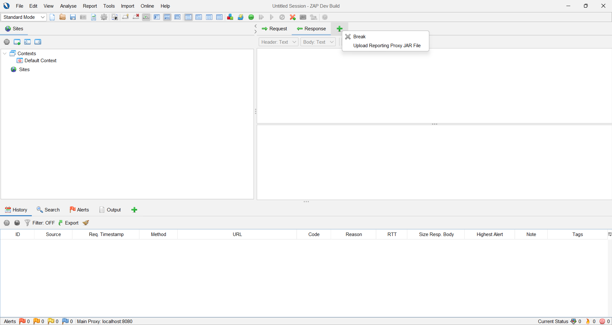
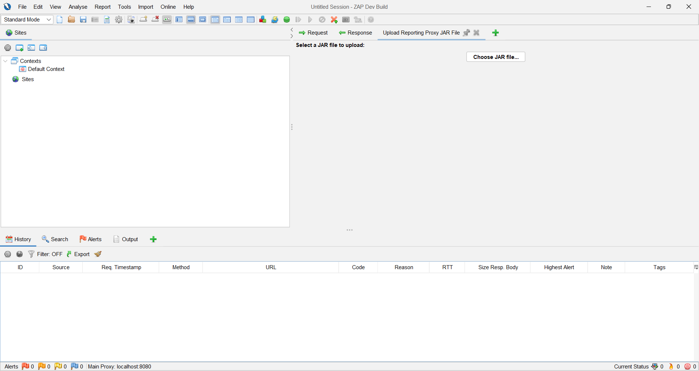

# Reporting Proxy Api

This document is an introduction for developers who want to define and upload their own rules. An example project which also contains this file can be foundin this repository.

## Description

The `Reporting-Proxy` addon in [Zaproxy](https://www.zaproxy.org/) allows developers to configure ZAP with a set of rules, so that they can receive live notifications
when a rule matches the observed traffic. These rules can be uploaded in a jar file via the Zaproxy gui. See [Uploading your Jar](#uploading-your-jar) on how to do this.

This project can be forked to easily get started on defining your own `ReportingRules`. Further below, there are more examples and documentation if you want to create your own project from scratch.

## Getting Started

### Dependencies
To get started defining new rules, you need two dependencies in your project

* Zaproxy (to use the [HttpMessage type](https://javadoc.io/doc/org.zaproxy/zap/2.9.0/org/parosproxy/paros/network/HttpMessage.html))
* `Reporting-Proxy` api, defined in a jar (see [releases](https://github.com/jesse3060/simpleRuleJar/releases/tag/v2.0.0)).

Concretely, you need to add the follow two dependencies to the `build.gradle.kts` file:
```gradle
dependencies {
    implementation(files("libs/reportingproxy-api.jar"))
    implementation("org.zaproxy:zap:2.15.0")
}
```

### Defining new Rules

A valid `ReportingRule` always needs to implement the `ReportingRule` interface which consits of a `handleMessage` and `getDisplayName` method. The first method returns a `ReportingRuleResult` instance, which can either be a `ReportingRuleSucces` or `ReportingRuleFailure`. The second method is used in the UI to correctly display the name of a rule when a rule returns a failure.

*Example:*
```Java
public class AlwaysPostiveRule implements ReportingRule {

    @Override
    public ReportingRuleResult handleHttpMessage(org.parosproxy.paros.network.HttpMessage msg, boolean isSendRequest) {
        return new ReportingRuleSuccess(this);
    }

    @Override
    public String getRuleDisplayName() {
        return "Always Positive";
    }
}
```

A `ReportingRuleSucces` only holds a reference to the rule that triggered it. A `ReportingRuleFailure` however can contain more info about the rule that was triggered. It always contains the rule that was triggered,
the `HttpMessage` that triggered it, a description message and a list of all relevant `HttpMessages`.
*Example:*
```Java
public class AlwaysNegativeRule implements ReportingRule {

    @Override
    public ReportingRuleResult handleHttpMessage(HttpMessage msg, boolean isSendRequest) {
        return new ReportingRuleFailure(this, msg, List.of(msg), "I always trigger!");
    }

    @Override
    public String getRuleDisplayName() {
        return "Always Negative";
    }
}
```
You can implement a rule however you like, however **the constructor is not allowed to have parameters.**

To view the full documentation of the `ReportingRule`, `ReportingRuleSuccess` and `ReportingRuleFailure`, please have a look at the [Reporting-Proxy Repository](https://gitlab.kuleuven.be/distrinet/education/design-of-software-systems/2025-2026/Group-04/zap-extensions/-/tree/reporting-proxy/main/addOns/reportingproxy/src/main/java/org/zaproxy/addon/reportingproxy/api?ref_type=heads)

### Building the rule jar

After you have implemented new rules, build your jar using Gradle

```bash
./gradlew build
```

### Uploading your jar

**1. Press the green '+' button next to 'Response'**

**2. Select the jar you want to upload in 'Choose JAR file...'**

## Help

If you encounter any issues or if you have any feedback, please contact us.

## Authors
[Adriana D'Hooghe](adriana.dhooghe@student.kuleuven.be)
[Rowan Helewaut](rowan.helewaut@student.kuleuven.be)
[Jesse Op 't Eynde](jesse.opteynde@student.kuleuven.be)
[Marie Schrevens](marie.schrevens@student.kuleuven.be)
[Mats Vanhamel](mats.vanhamel@student.kuleuven.be)
[Wout Vanhecke](wout.vanhecke@student.kuleuven.be)


## Version History

* 1.0
    * Initial Release
